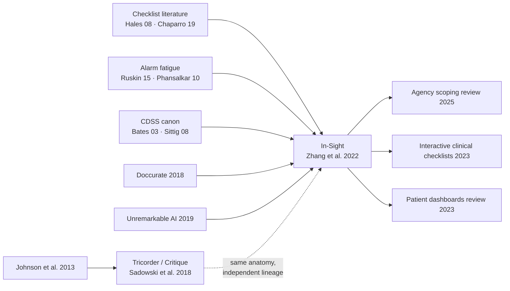

# Research: problem-curated views — 2026-07-16

Query: does the "organise the projection around detected problems" anatomy recur beyond In-Sight, and do its three commitments survive contact with other literatures? Generated via `/research`, ahead of splitting the node out of purpose-keyed view.

> *Retrieval provenance*. arXiv primary: 5 query variants, ~45 unique candidates; the alarm-fatigue query returned zero (venue-locked in medical informatics — covered instead by In-Sight's own bibliography, extracted full-text from `references/get-to-the-point.pdf`). Semantic Scholar: the In-Sight lineage call and one topic search (static-analysis actionability) succeeded before sustained 429s; three searches (guided analytics, CDSS display, triage queues) were rate-limited and not retried. Canon reads for the two venue-locked SE papers (Johnson et al. 2013, Sadowski et al. 2018) were grounded via web search — abstract/summary level, not full-text. In-Sight's forward citations (15) come from the successful S2 call.

## Context

The candidate pattern: an actor returns to a body of state asking "what needs my attention, and why"; the system runs explicit detection rules and presents a checklist of candidate problems doubling as index and navigation; selecting one prunes the general view to an annotated slice carrying the rule that fired. Currently grounded in one system (In-Sight, Zhang et al. 2022) plus a scoping review (Zhang, Wang & Yi 2025) that decomposes the same system into five agency control mechanisms.

Questions:
1. Does the checklist/triage anatomy recur outside clinical UI, and does anyone name it as a pattern?
2. Is the annotation-asymmetry commitment (flags only on solicitation) supported or contradicted elsewhere?
3. What does the alarm-fatigue / false-positive literature say about rule-set upkeep?
4. Is codifiability as the scoping condition studied?
5. Same move or different: next-best-action, management-by-exception, triage queues?

## Retrieved papers

- *Get to the point! Problem-based curated data views to augment care for critically ill patients* (CHI 2022) — the anchor; full text in `references/get-to-the-point.pdf`. [doi:10.1145/3491102.3501887]
  - Speaks to: all questions (source of the strawman)
  - Transfer: strong — it is the strawman
- *Lessons from building static analysis tools at Google* (CACM 2018, Sadowski et al.) — Tricorder; canon read, web-grounded. [doi:10.1145/3188720]
  - Speaks to: Q1, Q2, Q3
  - Transfer: strong — the same anatomy at industrial scale, with the commitments operationalised: flags surfaced *at code-review time* inside Critique (earlier ambient/dashboard attempts failed); "a false positive is any report the user did not want to see"; ≤10% effective-false-positive budget; a NOT USEFUL feedback button with continuous monitoring; noisy checks removed
- *Why don't software developers use static analysis tools to find bugs?* (ICSE 2013, Johnson et al.) — canon read, web-grounded. [doi:10.1109/ICSE.2013.6606613]
  - Speaks to: Q2, Q3
  - Transfer: strong — 20 developer interviews; false positives and *the way warnings are presented* are the named adoption barriers
- *Detecting false alarms from automatic static analysis tools: how far are we?* (ICSE 2022) — S2 retrieval, 88 citations
  - Speaks to: Q3, Q4
  - Transfer: partial — shows even the ground-truth oracle for "actionable warning" is heuristic; codifiability limits exist *inside* the rule pipeline, not only at domain boundaries
- *An empirical study of suppressed static analysis warnings* (Proc. ACM Softw. Eng. 2025) — S2 retrieval
  - Speaks to: Q3
  - Transfer: partial — suppression as the failure end-state when rules aren't tended: the actor mutes the checklist rather than the checklist earning attention
- *Unremarkable AI: fitting intelligent decision support into critical clinical decision-making processes* (CHI 2019, Yang, Steinfeld & Zimmerman) — ancestor, cited by In-Sight; abstract-grounded
  - Speaks to: Q2
  - Transfer: strong — decision support succeeds when it rides an existing workflow rhythm unremarkably rather than demanding attention; the clinical twin of Tricorder's review-time lesson
- *Supporting awareness of dynamic data: designing and capturing data within interactive clinical checklists* (DIS 2023) — In-Sight citer
  - Speaks to: Q1
  - Transfer: strong — the checklist-with-live-data anatomy pursued as a design object in its own right
- *Patient dashboards of electronic health record data to support clinical care: a systematic review* (IEEE ICHI 2023) — In-Sight citer
  - Speaks to: Q1
  - Transfer: partial — locates In-Sight within the clinical-dashboard literature; the review vocabulary stays data-organised, which is itself evidence the problem-organised carve is not yet named
- *Misinformation as a harm: structured approaches for fact-checking prioritization* (arXiv 2312.11678) — arXiv retrieval
  - Speaks to: Q1, Q5
  - Transfer: weak-to-partial — triage prioritisation for fact-checkers: detection rules ranking a work queue; anatomy kin where problems are work items
- *Prescriptive business process monitoring for recommending next best actions* (arXiv 2008.08693) — arXiv retrieval
  - Speaks to: Q5
  - Transfer: partial as contrast — NBA systems recommend *the action*; the boundary marker for what problem-curation deliberately does not do

## Convergent findings

### 1. The anatomy recurs across at least three domains, and nobody names it as a pattern (Q1)

Clinical (In-Sight; interactive clinical checklists; CDSS problem lists), developer tooling (IDE problems panel; Tricorder inside Critique), and ops/content triage (fact-checking prioritisation; moderation worklists) all converge on: rule-detected problems as a list that doubles as index and navigation, selection yielding an annotated slice, provenance attached. No pattern language or review names it as a UI pattern — the 2023 clinical-dashboard systematic review still organises by data type. Same situation as writable views in the view-system gate: the mint names new ground.

*Draft project takeaway*: the problem-curated view node is naming, not importing — cite In-Sight and Tricorder as the two independent full-anatomy exemplars.

### 2. Annotation asymmetry is directionally right but voiced wrong: the law is "annotate the judgement moment", not "annotate only on request" (Q2)

The strawman commitment says flags appear only after guidance is solicited. Tricorder's history is sharper: ambient surfacing (dashboards, FindBugs reports off to the side) failed; what worked was attaching flags to code review — a moment when the author has already put the work forward for judgement. Yang et al. reach the same conclusion in clinics: support must ride an existing workflow rhythm, unremarkably. Johnson et al.'s interviews name warning presentation, not warning existence, as the barrier. In-Sight's exploratory-view asymmetry is one instance of the general law: flag where judgement is already being exercised; spare the moments of exploration and formation.

*Draft project takeaway*: re-voice the first commitment — annotations belong at the workflow's judgement moments (review, rounds, the scheduled check), and are kept out of exploration; "on solicitation" is one honest implementation, not the rule itself.

### 3. Rule upkeep is the pattern's running cost, and it has a budget and a feedback loop (Q3)

The false-positive literature is unanimous: "a false positive is any report the user did not want to see" (Tricorder), and the survival mechanism is institutional — a noise budget (≤10% effective false positives), a feedback channel on every flag (NOT USEFUL), continuous monitoring, and the removal of noisy checks. The suppressed-warnings study shows the decay path when this is absent: actors mute rules wholesale, and the checklist keeps rendering while no longer being believed. Clinical alarm fatigue (Ruskin & Hueske-Kraus 2015; Phansalkar et al. 2010; Baron et al. 2021 — all in In-Sight's bibliography) is the same curve under higher stakes.

*Draft project takeaway*: add a consequence — a problem-curated view is a rule set someone must tend; without a feedback channel and a noise budget, it decays into alarm fatigue and then suppression, the view still rendering after trust has left.

### 4. Codifiability is graded, not binary (Q4)

The ICSE 2022 false-alarm study shows the ground truth for "is this warning real" is itself heuristic — codifiability limits sit inside codifiable domains, not just at their borders. The scoping condition holds, but as a gradient: the question is not "can this domain host detection rules" but "how much of the domain's judgement do the rules capture, and who notices the remainder". The escape-hatch commitment carries that remainder.

*Draft project takeaway*: keep codifiability as the scoping condition, worded as a gradient with the escape hatch as its complement.

### 5. Next-best-action is the neighbouring move, split by where judgement lands (Q5)

Prescriptive process monitoring and NBA systems recommend *the action*; problem-curated views curate *perception* — what to look at and why — and hand the judgement to the actor with provenance. Management-by-exception is the managerial ancestor of the watch side. Triage worklists are the same anatomy with problems as allocatable work items. This confirms the planned `serves: assistance` note: the perceiving station, deliberately stopping short of the acting one — which is exactly where next-best-action picks up.

*Draft project takeaway*: the future assistance/AI inbound edge (the fission trigger) contrasts the two at the perceiving/acting boundary.

## Lineage

### Convergent ancestors (from In-Sight's bibliography; full-text extraction)
- Checklists as cognitive aids: Chaparro et al. 2019 (review); Hales et al. 2008; Thomassen et al. 2014 — the scaffolding-vs-fossilisation framing's home
- Alarm fatigue: Ruskin & Hueske-Kraus 2015; Phansalkar et al. 2010; Baron et al. 2021 (alert burden)
- CDSS canon: Bates et al. 2003 (ten commandments); Sittig et al. 2008 (grand challenges); Garg et al. 2005
- Curation prior: Sultanum et al. 2018 (Doccurate) — same group, curation-based clinical text views
- Unremarkable AI: Yang et al. 2019
- Analytic focus: Zhou et al. 2021 (modeling analytic focus during exploratory visual analysis)

### Influential descendants (S2 citers of In-Sight, 15 total)
- Zhang, Wang & Yi 2025 (CSCW scoping review) — decomposes In-Sight into five agency control mechanisms: context awareness, accept/dismiss gatekeeping, system-controlled adaptive scaffolding, rule-based transparency, iterative feedback
- DITTO (TVCG 2024) — digital-twin treatment views
- Interactive clinical checklists (DIS 2023); patient dashboards systematic review (ICHI 2023); several CDSS-presentation studies (CHI 2025–26)

The two lineages (clinical, developer tooling) do not cite each other — the convergence is independent, which strengthens the pattern claim.

## Promotion candidates

- [ ] Re-voice the annotation-asymmetry commitment before minting: "annotate the judgement moment" (finding 2) — this is a correction to the strawman, the run's strongest result
- [ ] Add the rule-upkeep consequence with the noise-budget/feedback-channel mechanism (finding 3)
- [ ] Cite Sadowski et al. 2018 and Johnson et al. 2013 on the node as the second independent exemplar lineage
- [ ] Consider a one-line `docs/references.md` entry pointing at this note for the Tricorder lessons
- [ ] The alarm-fatigue trio (Ruskin, Phansalkar, Baron) stays available via In-Sight's bibliography; cite Ruskin directly if the failure-mode paragraph grows
