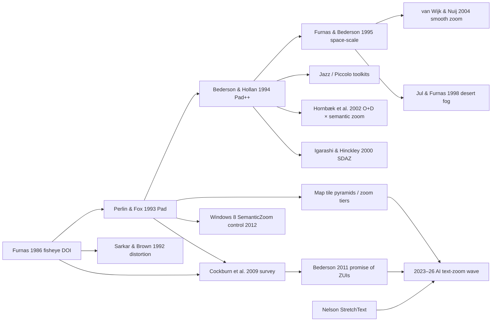

# Research: semantic zoom — 2026-07-08

Query: semantic zoom — origins, boundary with focus-and-context, relation to item-view's level-of-detail ladder, and whether discrete-threshold snapping is essential. Generated via `/research`. Precedes authoring the pattern-site entry (T4 of the workspace-split closure plan).

> *Retrieval provenance.* arxiv searched (5 quoted-phrase queries returned nothing; 5 loosened queries → 19 unique HCI-adjacent candidates, ~5 relevant — all recent descendants, none of the classic lineage, which is pre-arxiv ACM work). Semantic Scholar rate-limited throughout (429 on both attempts, no `S2_API_KEY`); the API-driven lineage step is therefore skipped, but this run substitutes verified lineage from full-text extraction of the two survey/retrospective papers (Cockburn et al. 2009 CSUR; Bederson 2011 BIT), both fetched and read in full. Professional sources via WebFetch/WebSearch. Two sources supplied by the user mid-run: Obenauer's lab note 038 and prathyvsh's semantic-zoom repository plus its companion X thread (read via browser; one Mar 2026 embed in the thread failed to load and is unrecorded).

---

## Context

*Topic:* semantic zoom — the interaction move, not any one implementation.

*Interaction:* An actor changes viewing scale over a space of content; instead of geometric magnification, the representation itself changes — coarser abstractions when zoomed out, richer detail when zoomed in — while spatial relationships stay legible.

*Setting:* The entry lands with territory T4. Existing local material: the paused exec spec ([plans/paused/2026-semantic-zoom-1.md](../../plans/paused/2026-semantic-zoom-1.md), discrete LOD thresholds with snap-and-animate between circle → label → card → reading panel) implemented in `SemanticZoom.stories.tsx` on tldraw ContentCards; item-view's semantic-level ladder (reference/summary/detail/full); focus-and-context and pan-and-zoom as territory neighbours. Also on disk: `references/semantic-zoom/` holds three mp4s (saved 2026-06-10, provenance unrecorded — likely demo videos from the practitioner wave below; worth confirming).

*Questions this run targeted:*

1. Where does semantic zoom end and focus-and-context begin? Shared Furnas ancestry, same closure territory.
2. Is semantic zoom the transition move over item-view's level-of-detail ladder, or a distinct construct?
3. Is the discrete-threshold "snap" between representations essential to the pattern, or one mechanism choice among continuous alternatives?

---

## Retrieved papers / sources

| Source | Year | Speaks to | Transfer |
|---|---|---|---|
| Perlin & Fox — *Pad: an alternative approach to the computer interface* (SIGGRAPH) | 1993 | Q3 | strong — origin of the term |
| Furnas — *Generalized fisheye views* (CHI) | 1986 | Q1 | strong — shared ancestor |
| Bederson & Hollan — *Pad++* (UIST '94; expanded 1996) | 1994 | Q2, Q3 | strong |
| Furnas & Bederson — *Space-scale diagrams* (CHI) | 1995 | Q3 | strong — the formal frame for zoom trajectories |
| Jul & Furnas — *Critical zones in desert fog* (UIST) | 1998 | Q3 | strong — navigation hazard of multiscale spaces |
| Igarashi & Hinckley — *Speed-dependent automatic zooming* (UIST) | 2000 | Q3 | partial — pan/zoom coupling mechanics |
| Hornbæk, Bederson & Plaisant — *Navigation patterns and usability of zoomable UIs with and without an overview* (TOCHI) | 2002 | Q1 | strong — the one direct empirical test of semantic zoom |
| van Wijk & Nuij — *Smooth and efficient zooming and panning* (InfoVis '03/journal '04) | 2004 | Q3 | strong — transition maths |
| Cockburn, Karlson & Bederson — *A review of overview+detail, zooming, and focus+context interfaces* (ACM Computing Surveys) [full text read] | 2009 | Q1–Q3 | strong — the organising taxonomy |
| Bederson — *The promise of zoomable user interfaces* (Behaviour & IT) [full text read] | 2011 | Q2, Q3 | strong — retrospective + design guidelines |
| ZMLT — *Multi-level tree based approach for interactive graph visualization with semantic zoom* (arXiv 1906.05996) | 2019 | Q3 | partial — graph LOD design goals |
| *Code Semantic Zooming* (arXiv 2510.06452) | 2025 | Q2 | partial — LLM-era descendant, zoom over code abstraction |
| *ZoomTable* (arXiv 2604.10461) / *Semantic zooming + edge bundling for supply-chain flows* (arXiv 2604.08823) | 2026 | — | weak — recency markers that the term is now standard vocabulary |
| Microsoft — *Semantic zoom* design guidance + `SemanticZoom` control (Windows 8 → UWP) | 2012 | Q2, Q3 | strong — the one design-system treatment |
| Mapbox / Google Maps — zoom-level documentation (23 integer tiers, quadtree tiling, zoom-conditional styling) | ongoing | Q3 | strong — the mass-deployed case |
| Obenauer — lab note 038, semantic zoom as an OS primitive [user-supplied] | 2023 | Q2, Q3 | strong |
| prathyvsh — *semantic-zoom* repository + X thread (51.6K views) [user-supplied] | 2025 | Q2, Q3 | strong — the practitioner corpus in one place |
| Wattenberger — *Fish-eye lens for text* essay | 2024 | Q1 | strong — practitioner statement of the F+C boundary |
| Ink & Switch / Muse — *Designing a studio for ideas*; nested boards, board overview zoom | 2021 | Q2 | partial |

Practitioner demos catalogued by the thread and repo (not independently verified beyond the thread's own videos): Orion Reed (graph↔text continuous spectrum in tldraw, 2024; zoomable wiki on folk.systems, 2025), tldraw (AI visual summaries of canvas regions, 2024), Arc Search (pinch-to-summarize a page, 2024), neilson (pinch summarises / pull-apart elaborates text, 2024), Tommy Hung (depth-of-field auto-focus on canvas nodes, 2024), Harley Turan (semantic pinch-to-zoom on mobile, 2024), Raduan Al-Shedivat (reading digest, 2025), Dion Systems (code editor zooming through levels of detail, defunct), Brendan Gregg's flame graphs, Boxento (dashboard), Sensescape and Graphologue (UCSD, 2023 — academic but reached via the thread).

---

## Convergent findings

### Cluster A — Semantic zoom is representation change under a scale control, and it was born discrete

*Convergent claim:* The defining move is that objects "have different visual representations at different sizes" (the term coined by David Fox in Pad) — as opposed to geometric zoom, which scales one representation. Nothing in the origin requires smooth animation: Pad's own zoom was a *jump* zoom, "each mouse click would redisplay the view magnified or reduced by a factor of two" (Bederson 2011), yet semantic zooming was already fully present.

Maps — the mass-deployed descendant — are equally discrete underneath: 23 integer zoom tiers, each with its own representation contract (continents → cities → streets → buildings), with continuous gesture input quantised onto tile pyramids. The Windows 8 `SemanticZoom` control is the extreme: exactly *two* views (zoomed-in list, zoomed-out index) with a pinch to switch — a semantic zoom with one threshold and no geometric zoom at all.

Papers/sources: Perlin & Fox 1993, Bederson 2011, Mapbox docs, Microsoft design guidance.

*Draft project takeaway:* Define the pattern by the representation ladder bound to a scale control, not by the transition style; the paused spec's discrete thresholds are lineage-faithful, not a simplification.

---

### Cluster B — The boundary with focus-and-context is simultaneity, not ancestry (Q1)

*Convergent claim:* Cockburn, Karlson & Bederson organise the whole territory on one dimension: overview+detail separates focus and context *in space* (two views at once), zooming separates them *in time* (one scale at a time, the whole viewport transforms uniformly), and focus+context "eliminates the spatial and temporal separation by displaying the focus within the context in a single continuous view". That is the boundary: in semantic zoom, detail is a function of *global scale* and is uniform across the viewport; in focus-and-context, detail is a function of *distance from the focal point* and is deliberately non-uniform. The moment one region of the view is more detailed because the actor is attending to it — fisheye distortion, Wattenberger's fovea, Tommy Hung's auto-focus depth-of-field — the move is focus-and-context, even if implemented on the same canvas with the same LOD ladder.

The shared ancestry is real but sits *below* both patterns: Furnas's 1986 degree-of-interest formalism (DOI = a-priori importance − distance from focus) determines *what* to show; both patterns are answers to *how*. Notably Furnas's original fisheye was itself semantic filtering (dropping low-DOI items), not geometric distortion — the distortion reading came later (Sarkar & Brown 1992). Wattenberger states the practitioner version plainly: fisheye "lets us experience both simultaneously", where zooming forces a choice of level.

Hornbæk et al. 2002 supplies the empirical hinge between the categories: on map navigation, adding an overview panel *slowed users down* when semantic zooming was on — "this cost is due to the overview being made redundant by the semantic detail" — while users still preferred having the overview. Good semantic zoom partially substitutes for simultaneous context; that is exactly why the two patterns feel adjacent.

Papers/sources: Cockburn et al. 2009, Furnas 1986, Wattenberger 2024, Hornbæk et al. 2002.

*Draft project takeaway:* Edge shape for the entry — semantic zoom and focus-and-context are `alternative` resolutions of the same force (detail without loss of context), split by whether detail varies with global scale (uniform, temporal) or with attention (non-uniform, simultaneous); both descend from Furnas's DOI, which is worth naming in prose on both pages rather than forcing a graph edge through a construct the language doesn't have.

---

### Cluster C — The LOD ladder is the substance; zoom is one binding of it (Q2)

*Convergent claim:* What semantic zoom traverses is precisely an item-view-style representation ladder; what makes it *zoom* is binding that ladder to a continuous spatial control applied uniformly over a population of items, with spatial relationships preserved. Three independent sources make the decoupling visible:

- Bederson counts the Office ribbon as semantic zooming: it "display[s] more information when more space is available" as the window resizes — no zoom gesture anywhere; the representation responds to *allocated space*.
- Obenauer's item components "swap out depending on space available", and expanded components "adjust their position, so increased detail remains in broader context" — item-view's ladder driven by a continuous space budget rather than discrete navigation.
- The Windows 8 control requires that "item layout and panning direction don't change based on the zoom level" and that the two views stay synchronised — the population-wide, position-preserving contract stated as design guidance.

Read against the project's constructs: item-view owns the ladder (reference/summary/detail/full) and its per-item, navigation-driven transitions (hover → popover, click → panel, `onEscalate`); semantic zoom is the *coordination move* that drives the same ladder for all items at once from a single scale/space control. The answer to Q2 is therefore "the transition move over those levels" — but with two obligations item-view doesn't carry: uniformity across the population, and continuity of spatial arrangement (the paused spec's "edges re-anchor smoothly" clause is this obligation, stated for graphs).

Papers/sources: Bederson 2011, Obenauer LN038, Microsoft guidance, plus the project's own item-view page.

*Draft project takeaway:* Author semantic zoom as a distinct entry that `complements` item-view — item-view supplies the representation vocabulary, semantic zoom supplies the scale-bound, population-wide traversal policy; don't fold either into the other.

---

### Cluster D — Snap vs morph is a presentation axis over an inherently discrete ladder (Q3)

*Convergent claim:* Representations are discrete artifacts — a dot, a title chip, and a summary card don't semantically interpolate — so *thresholds are unavoidable*; what varies is how the crossing is presented (hard snap, crossfade, morph) and what happens geometrically between thresholds. The empirical literature is about making crossings legible, not about eliminating them: Bederson & Boltman show animated transitions help users build a spatial model of the space; transition times of 0.3–1.0 s are repeatedly supported; van Wijk & Nuij give the optimal pan-zoom trajectory when the transition covers distance. Bederson's guideline 3.2.5 adds the constraint the paused spec should keep: semantically swapped representations must keep the same footprint ("the small object must have the same aspect ratio – or at least fit in the same box as the full object"), or neighbours overlap on zoom-out.

The continuous end of the axis is where current practitioner energy is (Obenauer's fluid component swapping, Orion Reed's graph↔text "continuous spectrum", Wattenberger), and AI summarisation is what filled in the intermediate rungs for text (Cluster E). But the discrete end is not legacy: map tiers double as a shared *wayfinding vocabulary* (level ~10 ≈ city, ~15 ≈ streets), and predictable representation-per-tier is part of why maps escaped desert fog — Jul & Furnas's hazard of "an absence of orienting features" in multiscale spaces — which pure continuous morphing can reintroduce.

Papers/sources: Perlin & Fox 1993, Bederson & Boltman 1999 (via both surveys), van Wijk & Nuij 2004, Bederson 2011, Jul & Furnas 1998, Mapbox docs, Obenauer, Orion Reed.

*Draft project takeaway:* The snap is one mechanism choice, and the entry should say so — the invariant is discrete representation thresholds made legible in transit (animation, footprint stability, edge re-anchoring); whether the crossing is felt as a snap or dissolved into a morph is a force trade between transition comprehension and wayfinding by tier.

---

### Cluster E — AI summarisation reopened semantic zoom for text

*Convergent claim:* Semantic zoom historically worked where a small representation *already existed* (Bederson's guideline: "Photos are good, purely textual documents are bad"). Multi-level summarisation removes that precondition — the intermediate rungs of a text's ladder can now be generated — and this is explicitly what the 2024–25 practitioner wave runs on: the thread's framing ("becoming prominent … with AIs enabling multi-level text summaries"), Arc's pinch-to-summarize, neilson's pinch/pull-apart elaboration, tldraw's canvas-region summaries, Graphologue and Sensescape turning LLM output into zoomable structure, and the Code Semantic Zooming preprint doing the same over codebases. The repo's lineage is worth keeping: ZUIs and Nelson's StretchText are "two whole niches within the semantic zoom niche" — the generated-summary wave is StretchText's branch finally getting its material.

Papers/sources: Bederson 2011, prathyvsh thread/repo, arXiv 2510.06452.

*Draft project takeaway:* The entry's Materials section should name the precondition — a usable representation per rung — and note that generation now supplies missing rungs for text, which is why the pattern's applicability recently widened; connects to generated-content and transparent-reasoning territory.

---

### Cluster F — Zooming as the primary interface failed; semantic zoom survived as an ingredient

*Convergent claim:* Bederson's retrospective is unambiguous: "a richer kind of zooming that takes over the desktop … never materialised", commercial attempts (Sony VAIO ZUI, Zoomorama, Hillcrest HoME) stalled, and portals — the third original Pad idea — shipped nowhere. What survived is zooming *inside* task-shaped hybrids (maps, canvases, document viewers) and semantic zoom as a representation policy detached from ZUIs entirely (ribbon, media players). His guidelines double as the entry's force list: support overview-shaped tasks; "be cautious about using zooming as the primary interface … unless the data set is fundamentally spatial"; require recognisable small representations; prefer breadth over depth (objects hidden at deep scales are undiscoverable); meaningful vs consistent vs scannable layout pull against each other; and always compare against the humble alternative — "in many cases, the alternative to a ZUI is a simple tree widget".

Papers/sources: Bederson 2011, Cockburn et al. 2009.

*Draft project takeaway:* Position the entry as a move layered onto an already-spatial surface (canvas, map, graph — the project's tldraw substrate qualifies), not as an organising principle; the "would an outline do?" test belongs in the forces.

---

## Lineage

Semantic Scholar was rate-limited throughout, so no API-derived citation graph. The lineage below is assembled instead from the two full-text sources' own citations (Cockburn et al. 2009; Bederson 2011) — verified in that sense, but bounded by what those two papers cite; a `/research refresh semantic-zoom` with an `S2_API_KEY` could add the descendant side properly.

*Convergent ancestors (cited by effectively everything retrieved):*
- Furnas (1986) *Generalized fisheye views* — the DOI formalism both patterns descend from; also ancestor of Furnas (2006) *A fisheye follow-up*, which separates "what to show" from "how to show it"
- Perlin & Fox (1993) *Pad* — semantic zooming named; portals (the branch that died)
- Furnas & Bederson (1995) *Space-scale diagrams* — the analytical frame for everything trajectory-shaped
- Nelson's StretchText (via the practitioner repo) — the text-elaboration branch, now AI-fed

*Influential descendants:*
- Cockburn, Karlson & Bederson (2009) — the taxonomy that settled the category boundaries
- Bederson (2011) — the verdict and the guidelines
- The 2023–26 wave: Sensescape/Graphologue, Obenauer, Orion Reed, Arc, tldraw, Code Semantic Zooming — semantic zoom as an AI-era text/knowledge move

---

## Promotion candidates

- [ ] Cockburn, Karlson & Bederson (2009) → strongest candidate for a `references/` distillation: it is the organising taxonomy for the *whole* T4 evaluation neighbourhood (overview-detail, pan-and-zoom, focus-and-context, semantic zoom) and would give all four entries one shared frame. The full text is extracted at hand if wanted.
- [ ] Bederson (2011) → one-liner in `docs/research/references.md`: the design guidelines and the cautionary verdict ("be cautious about using zooming as the primary interface") are directly citable in the entry's forces.
- [ ] Furnas (1986) → already the ghost ancestor of focus-and-context's "not sure this stands on its own" fun-meter doubt; the lineage answer is that it does stand — as the simultaneous-view branch of a shared DOI root. Worth a line whichever surface it lands on.
- [ ] Correction signal for existing content: item-view's Related components list currently describes semantic zoom as "density-preserving transitions between granularities" via a `ComponentRef` to a docs id that never existed (`actions-evaluation-semantic-zoom--docs`, the workstream-2 gate finding). The research supports repointing that line at the future pattern entry with the Cluster C framing (population-wide, scale-bound traversal of the ladder), which is stronger than "transitions".
- [ ] Provenance chore: identify the three mp4s in `references/semantic-zoom/` (2026-06-10) — likely Obenauer LN038 or thread demos; name them or note their source so the folder isn't opaque.
- [ ] The pan-and-zoom entry already cites Pad++; when the semantic-zoom entry lands, the two pages should split the lineage cleanly — Pad++/space-scale/desert fog with pan-and-zoom (the spatial navigation mechanics), Pad's semantic zooming + the representation-ladder sources here.

---

## Addendum (same day) — user-supplied adjacent source, view-system-shaped

*Malleable overview-detail interfaces* (Min, Chen, Cao & Xia, CHI 2025; [arXiv 2503.07782](https://arxiv.org/html/2503.07782v1)) — same UCSD group as Sensescape/Graphologue. Content analysis of 303 overview-detail instances plus interaction techniques ("Fluid Attributes") for end-user customisation. It belongs to the *view system* iteration (view, data-view, item-view, needs-based view) more than to this entry, but three pieces transfer:

- *Abstraction types* — the paper splits what changes between overview and detail into visual, semantic, and computational abstraction (thumbnail vs summary vs aggregate). That's an axis the item-view ladder and this pattern's rung definitions currently don't name: two rungs can differ not just in amount of data but in *kind* of abstraction.
- *Composition relations* — one-to-one / one-to-many / many-to-one and recursive nesting between overviews and details: ready vocabulary for view.mdx's navigation-mechanisms section and the data-view ↔ item-view edges.
- *Malleability evidence* — the study grounds view.mdx's `enacts: malleability` and its saved-views section empirically ("a single instantiation of the overview-detail pattern is inevitably not enough"); the hoarder/minimalist archetypes are a nice force statement for density configurability.

One caution for the view-system iteration: the paper uses *overview-detail* as the umbrella for everything the project calls the view system, while the project's own `overview-detail` page (T1) is a navigation topology. Same-label, different corpus — link, don't merge (Cockburn's taxonomy keeps them distinct: overview+detail is the spatial-separation category, of which the T1 page is one navigational reading).
