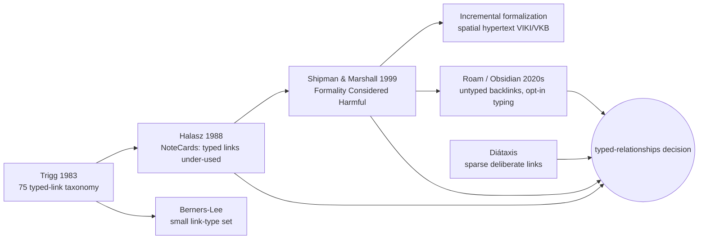

# Research: authoring typed relationships in MDX — 2026-06-23

Query: should we make pattern relationships explicit (frontmatter blocks + inline `rel` links +
decision-tree routing) with a generated cross-reference index? "What would I be wrong about?"
before committing. Generated via `/research`.

> *Retrieval provenance.* This is a hypertext/knowledge-organisation question, not an empirical
> HCI-systems one. arxiv (5 variant queries, ~45 candidates) was almost entirely off-topic —
> knot-theory "links", knowledge-graph ML — with two on-point hits ("Conceptual Analysis of
> Hypertext" 2018; "Automated Detection of Typed Links in Issue Trackers" 2022). Semantic
> Scholar was not queried; S2 lineage omitted (a conceptual lineage is given instead). The
> load-bearing evidence is canonical hypertext literature (Halasz, Trigg, Shipman & Marshall)
> and current PKM/docs tooling (Obsidian, Diátaxis), via web. Shipman & Marshall read in full
> (HTML); the rest via summaries — treat as orienting.

## Context

A two-language pattern/component library whose graph was previously derived by matching
Related-patterns *heading wording* to edge types — brittle and hard to predict. The proposed
move: explicit, declared edges from three structured sources — frontmatter `relationships:`,
inline `rel` on body links (`[Promenade](/patterns/promenade){rel="precedes"}`), and Mermaid
decision trees (`recommends` + situational hints) — with a generated completes/completed-by
index; untyped links decorative; nothing inferred from prose. Project stance: edges are
suggestion-grade, authored loosely, relationships should read naturally in prose.

Questions: (1) does required explicit typing cause under-typing/abandonment? (2) do generated
cross-reference sections get regretted? (3) two channels — flexibility vs ambiguity? (4) does
declarative typing ossify a loose graph? (5) the directional-note problem.

## Retrieved sources (canonical)

- *Reflections on NoteCards: Seven Issues for the Next Generation of Hypermedia*, Halasz,
  CACM 1988 — typed links, "the strongest formalization mechanism provided, were rarely used,
  and when they were, seldom used consistently. Both link direction and link semantics proved
  problematic." [https://ics.uci.edu/~dfredmil/ics227-SQ04/papers/Hypertext/Secondary/p836-halasz.pdf]
  - Speaks to: Q1, Q5. Transfer: *strong* — the canonical empirical result on exactly this.
- *Formality Considered Harmful*, Shipman & Marshall, CSCW Journal 1999 — requiring users to
  formalize (type, categorize, structure) causes system rejection across hypermedia/knowledge
  systems/groupware; users are *justified* in resisting. [https://people.engr.tamu.edu/shipman/formality-paper/harmful.html]
  - Speaks to: Q1, Q4, Q5. Transfer: *strong* — the deepest treatment of the cost we're taking on.
- *Trigg's link taxonomy* (PhD 1983) — 75 distinct typed-link relations (abstraction, example,
  refutation, support…); the elaboration itself created the authoring burden that made
  classification fail in practice. [via NN/g Hypertext'89 report: https://www.nngroup.com/articles/trip-report-hypertext-89/]
  - Speaks to: Q4. Transfer: *strong* — the vocabulary-proliferation cautionary tale.
- *HyperText Design Issues: Link types*, Berners-Lee (W3C) — early web argument for a small,
  purposeful set of typed relations. [https://www.w3.org/DesignIssues/LinkTypes.html]
  - Speaks to: Q4. Transfer: *partial* — web links, but the "keep the set small/purposeful" line holds.
- *Diátaxis — reference/explanation & linking* — advocates *deliberately sparse, strategic*
  cross-linking (Next steps / See also / inline-to-reference), not comprehensive linking
  everywhere; just-in-time references. [https://diataxis.fr/reference-explanation/]
  - Speaks to: Q2. Transfer: *partial* — docs framework, but directly about generated/placed links.
- *Obsidian: automated Maps of Content* (Dataview) — generated indexes are useful "when you
  already know the desired structure," but "less useful when part of your aim is creating the
  map to understand the relationship between different ideas"; parallel tags/MOCs drift.
  [https://readwithai.substack.com/p/automated-maps-of-content-in-obsidian]
  - Speaks to: Q2, Q3. Transfer: *strong* — the generate-vs-sensemaking tradeoff, in a live tool.
- *Automated Detection of Typed Links in Issue Trackers*, arXiv 2022 (cs.SE) — issue-tracker
  links (blocks/relates/duplicates) are typed *inconsistently* by humans, motivating automated
  detection. [arXiv:2211.xxxxx]
  - Speaks to: Q1. Transfer: *partial* — different domain, same human-inconsistency signal.

## Convergent findings

### 1. Required explicit typing is the classic formalization trap — the field escaped it
Halasz (typed links "rarely used… seldom consistent"), Shipman & Marshall (six reasons users
reject formalization: cognitive overhead, tacit knowledge resists articulation, premature
commitment risk, ambiguous link semantics/direction, no agreement across users, situational
structure), and the issue-tracker work all converge: making authors supply types is costly and
under-complied. The documented response was *inference* and *incremental* formalization — the
opposite of our "explicit, not inferred" decision. This validates our *goal* (predictability)
but flags our *means* as the very thing hypertext spent decades moving away from.
Papers: Halasz; Shipman & Marshall; Issue-tracker 2022.
*Draft project takeaway*: Treat explicit typing as opt-in, not required — the design's
decorative-untyped-links + two-optional-channels *is* Shipman's "incremental formalization", and
should be stated as the central safeguard, not an incidental convenience.

### 2. Link direction/semantics is the most-cited concrete failure
Both Halasz and Shipman single out *direction*: NoteCards "explanation" links pointed
explanation→concept sometimes, concept→explanation other times; adding "example" further
muddied "explanation". This lands squarely on our `rel` "from-this-page's-view" rule.
Papers: Halasz; Shipman & Marshall.
*Draft project takeaway*: Direction must be fixed *by the type*, not the author — `composed-of`
always means "target composes into this page", enforced and validated, or we reproduce the
NoteCards flip. The from-this-page rule is right but only if direction is crisp per type and
checked at extract time.

### 3. Keep the controlled vocabulary small, and resist growth
Trigg's 75 types created the burden; Berners-Lee argues for a small purposeful set. Our ~10 is
in the safe range, but each addition carries a documented cost.
Papers: Trigg; Berners-Lee.
*Draft project takeaway*: Hold the line on the ~10-type vocabulary; new types pass through the
changelog with a justification, never speculatively.

### 4. Generation helps when structure is settled, hurts when authoring *is* the sensemaking
Obsidian's MOC experience and Diátaxis's "sparse, deliberate" linking agree: a generated index
is good for a known structure but removes the thinking when mapping relationships is itself the
work, and comprehensive auto-linking violates just-in-time sparseness. For this project the
relationships *are* part of the semilattice sensemaking.
Papers: Obsidian MOC; Diátaxis.
*Draft project takeaway*: Make the generated index *sparse and orderable* (author-curated
emphasis/ordering, grouped completes/completed-by), not an exhaustive dump — generation of the
*rendering*, not of the *decision* about which relationships matter.

## What I would be wrong about (the framed risk)

- *Wrong to treat explicit typing as "free predictability."* It buys predictability at the
  exact authoring cost (overhead, under-typing, abandonment) hypertext documented for 30 years.
  The mitigation is already in the design — optionality — so make it load-bearing: never require
  a `rel`; a bare link is always valid.
- *Wrong to expect the graph to mirror the prose.* Authors will narrate links without typing
  them. The graph is a deliberate *subset*, not a mirror; don't build features that assume
  completeness.
- *Direction is the predictable failure.* Bake direction into each type and validate it; do not
  let authors choose direction.
- *Two channels multiply the formalization surface* (Shipman cost #1; Obsidian parallel-structure
  drift). Make inline the primary channel for narrated edges and frontmatter the exception, and
  detect duplicate/conflicting declarations at extract time.
- *Wrong to fully generate the Related-patterns section.* Generate the rendering; keep authorial
  control over which relationships are surfaced and in what order, per Diátaxis sparseness.
- *Telling counter-evidence to weigh*: the dominant modern PKM tools (Roam, Obsidian backlinks)
  chose *untyped* bidirectional links; typing is opt-in (Dataview fields). The market largely
  sided with Shipman. We are deliberately going the other way for a curated, small corpus with a
  settled vocabulary — which is a defensible exception, but it *is* an exception.

## Lineage (conceptual; S2 omitted — see provenance)

*Convergent ancestor*: Shipman & Marshall is downstream of Halasz/Trigg and the clearest
statement of the cost. *Influential descendant*: modern untyped-backlink PKM tools are the
field's de-facto verdict — opt-in typing, never required.

## Promotion candidates

- [ ] *Shipman & Marshall, "Formality Considered Harmful" (1999)* → strong candidate for a
  `references/formality-considered-harmful.md` canon file: it is the load-bearing argument for
  keeping typing optional/incremental and is likely to recur whenever the project adds
  formalized metadata.
- [ ] *Halasz, "Reflections on NoteCards" (1988)* → `docs/references.md` one-liner: the
  empirical source for "typed links are under-used and direction-inconsistent."
- [ ] *Design correction to flag in the spec*: the relationship schema should state explicitly
  that typing is opt-in (incremental formalization), direction is type-fixed and validated, and
  the generated index renders but does not decide — promote these from "implications" to
  written invariants in `graph-relationship-model.md`.
