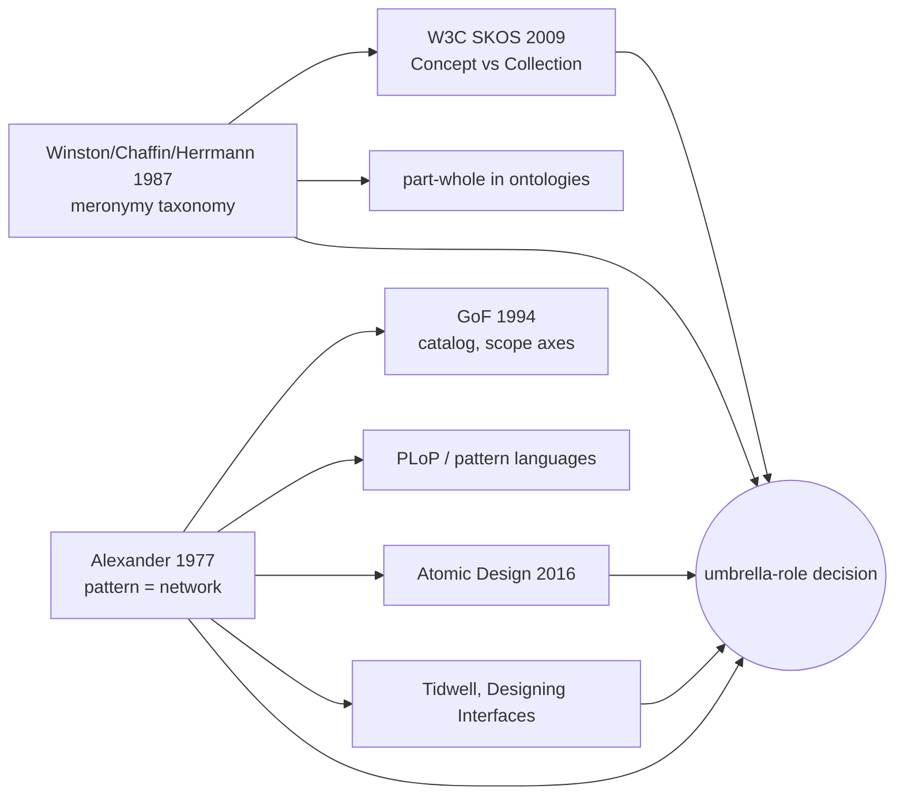

# Research: how pattern languages encode scale, altitude, and composition — 2026-06-22

Query: should `role: umbrella` be redefined, deprecated, or replaced by narrower/wider
(composed-of / completes) relations? Framed as "what would I be wrong about?" before a
schema change. Generated via `/research`.

> *Retrieval provenance.* This is a meta-theory / knowledge-organisation question, not an
> empirical HCI one. arxiv was queried with 5 variant queries (~50 unique candidates) and
> returned almost entirely off-topic results (gene ontologies, audio nets, ontology-matching
> ML) — the corpus does not cover pattern-language structure. Semantic Scholar was therefore
> *not* queried and S2 lineage (step 6) is omitted; a conceptual lineage among canonical
> sources is given instead. The load-bearing evidence is canonical: W3C SKOS, Alexander,
> Winston/Chaffin/Herrmann's meronymy taxonomy, Brad Frost's atomic design, GoF, Tidwell —
> all retrieved via web search. Treat citations as orienting, not exhaustive; book/spec
> sources were read via summaries, not full text.

## Context

Two-language pattern/component library (interaction *moves* vs form *mechanisms*), organised
by Activity-Theory altitude. `role: umbrella` is currently defined as "an authored survey
over a territory of related moves, not the authoritative source for one move," and the graph
renders umbrella→children as a `surveys` edge (173 instances). The role bundles two unlike
populations:

- *Strata / index pages* — `actions`, `operations`, `activities`, `elements`, `qualities`,
  `navigation-overview`. Genuine maps over an altitude; nobody *does* an "actions."
- *Composite moves* — `form`, `block-based-editor`, possibly `status-feedback`,
  `cognitive-forcing-functions`, `bot`, `assisted-task-completion`. Things an actor does, at
  a higher altitude than their parts.

Provoking case: Alexander's Promenade — a composite pattern with its own emergent identity,
not "merely where smaller patterns coincide." Post-reframe, `form.mdx` now *asserts* form-hood
as an emergent move, which contradicts its own role's "not the authoritative source" clause.

Questions:
1. Do mature pattern languages encode scale as a node *type/role* or as a *relation*?
2. Prior art for separating "a concept with narrower concepts" from "a labelled grouping
   that is not itself a concept"?
3. When composition is universal, does a "composite/umbrella" marker earn its keep?
4. What would I be wrong about in deprecating `umbrella` for composite moves?

## Retrieved sources (canonical)

- *SKOS Reference & Primer* (W3C Recommendation, 2009) — separates `skos:Concept` (carrying
  `broader`/`narrower`/`related` semantic relations) from `skos:Collection`, an optional
  *grouping* of concepts that is **disjoint** from `Concept` and **cannot** carry semantic
  relations. [https://www.w3.org/TR/skos-reference/]
  - Speaks to: Q1, Q2. Transfer: *strong* — this is almost exactly the project's situation,
    a formal model that already separates the two populations umbrella conflates.
- *A Pattern Language* / *The Timeless Way of Building*, Alexander et al. (1977/1979) — a
  pattern language is a *network*; each pattern "exists only to the extent it is supported by
  the larger patterns in which it is embedded, the patterns of the same size that surround it,
  and the smaller patterns embedded in it." [https://en.wikipedia.org/wiki/Pattern_language]
  - Speaks to: Q1, Q3. Transfer: *strong* — the source the project already invokes.
- *A Taxonomy of Part-Whole Relations*, Winston, Chaffin & Herrmann, Cognitive Science 11
  (1987) — six distinct meronymic relations, incl. **component–integral** (pedal–bike) vs
  **member–collection** (ship–fleet); part-whole is **not transitive across types**.
  [https://onlinelibrary.wiley.com/doi/abs/10.1207/s15516709cog1104_2]
  - Speaks to: Q2, Q4. Transfer: *strong* — names the precise relation the `surveys` edge
    fuses.
- *Atomic Design*, Brad Frost (2016), ch. 2 — atoms/molecules/organisms is "not a linear
  process… a mental model to think of UIs as both a cohesive whole and a collection of parts
  at the same time"; organisms are composed of atoms/molecules/*other organisms*; "the labels
  have never been the point." [https://atomicdesign.bradfrost.com/chapter-2/]
  - Speaks to: Q3, Q4. Transfer: *strong* — the design-system-native treatment of recursive
    composition, and the counterweight (keep labels as a communication aid).
- *Design Patterns*, Gamma/Helm/Johnson/Vlissides (1994) — patterns categorised by *purpose*
  (creational/structural/behavioral) and *scope* (class/object), **never by scale**; a catalog,
  not a language; the *Composite* pattern itself treats a node as both leaf and container.
  [https://www.digitalocean.com/community/tutorials/gangs-of-four-gof-design-patterns]
  - Speaks to: Q1, Q3. Transfer: *partial* — software, not interaction, but the categorisation
    axes are instructive: scale is not one of them.
- *Designing Interfaces*, Tidwell (3rd ed.) — patterns grouped by *functional theme*, not a
  rigid hierarchy; each chapter opens with a "big picture" orientation that is explicitly
  **not a pattern**, followed by the patterns. [https://www.uxmatters.com/mt/archives/2006/11/book-review-designing-interfaces.php]
  - Speaks to: Q1, Q2. Transfer: *strong* — a working IxD library where the survey/orientation
    page and the pattern are different kinds of object.

## Convergent findings

### 1. Scale is encoded as a *relation*, never as a node type
Alexander (embedded-in / embeds), GoF (purpose + scope axes, not scale), and atomic design
(recursive composition) all encode altitude relationally or as a soft mental aid — none makes
"is-large" a node *kind*. Every pattern is simultaneously larger-than-some and smaller-than-
others; a `role: umbrella` freezes a relative position into an absolute type.
Papers: Alexander; GoF; Frost.
*Draft project takeaway*: Scale belongs on edges (and on the existing `activityLevel` facet),
not in the role — `umbrella` as an altitude marker duplicates `activityLevel` and mistakes a
relation for a type.

### 2. The two populations umbrella conflates are a known, formalised split
SKOS draws exactly this line: a `Concept` participates in `broader`/`narrower`; a `Collection`
is a labelled grouping, *disjoint* from Concept, that carries **no** semantic relations. The
composite moves (`form`) are Concepts with narrower concepts; the strata/index pages
(`actions`) are Collections. Tidwell's "big picture" chapter intro is the same object — an
orientation that is not itself a pattern. SKOS adds a hard constraint the project would
otherwise miss: a Collection **must not** sit in the broader/narrower hierarchy — so index
pages should be *outside* the composition graph, not coarse nodes within it.
Papers: SKOS; Tidwell.
*Draft project takeaway*: Keep a grouping role for genuine survey pages but model it as a
SKOS-style *collection* (members, no composed-of edges), distinct from composite *patterns* —
and stop letting index pages and composite moves share one role or one edge type.

### 3. The `surveys` edge fuses two distinct part-whole relations
Winston/Chaffin/Herrmann separate **component–integral** (a form's fields *make up* the form)
from **member–collection** (patterns *grouped under* "actions" for browsing). The single
`surveys` edge collapses both. Because meronymy is **not transitive across types**, the fused
edge cannot be reasoned over: traversing `form → bounded-choice` (composition) and
`actions → form` (membership) as one relation yields invalid inferences. This is a concrete
graph-integrity defect, not only a framing nicety.
Papers: Winston et al.; SKOS.
*Draft project takeaway*: Split `surveys` into `composed-of` (component–integral, composite
move → constituent move) and `indexes`/`member-of` (collection → member); never traverse the
two as one path.

### 4. Composition is universal and recursive — "composite" is not a distinguishing role
Alexander (every pattern embeds smaller ones), atomic design (organisms contain organisms),
and the GoF Composite pattern (node is both leaf and container) agree: composition is the
default condition of any non-leaf, not a special class. A `form` is a pattern that happens to
have narrower patterns — like every non-atomic pattern.
Papers: Alexander; Frost; GoF.
*Draft project takeaway*: Reclassify composite moves to `role: pattern` + `atomic: composition`
+ `composed-of` edges; compositeness is already carried by the facet and the edge, so no role
is needed for it.

## What I would be wrong about (the framed risk)

- *Wrong to drop a scale marker entirely.* Atomic design keeps level labels deliberately as a
  shared mental model even while insisting "the labels aren't the point." A purely relational
  encoding loses at-a-glance altitude. Mitigation: the project *already* has `activityLevel` —
  so altitude is covered without `umbrella`. The risk is only real if one deletes the role
  *and* forgets the facet already does that job.
- *Wrong to assume a clean 2-way sort.* Winston's taxonomy implies at least three outcomes,
  not two: (a) component–integral → composite *pattern* (`form`); (b) member–collection theme
  → *collection* (`cognitive-forcing-functions`, `bot`, `assisted-task-completion` may be
  families, not single emergent moves); (c) altitude stratum → possibly *generated nav* rather
  than an authored node at all (`actions`, `operations`). The member-vs-component test is the
  sorting instrument: *do the children make up this thing, or are they merely filed under it?*
- *Wrong to treat "authoritative source" as the axis.* It is downstream of the type. SKOS
  Collections still have authored labels/scope notes; "survey not source" is coherent prior
  art — but the fix is to model it as a collection, not to keep a role whose name (`umbrella`)
  invites the composite-move misreading that snared `form`.
- *Open risk — edge cost.* Replacing `surveys` with `composed-of` + `indexes` is a real
  extractor/graph change (the headings "Composed from"/"Used by" currently collapse into
  `related`). Modest, since `surveys` already extracts as a first-class edge, but non-zero.

## Lineage (conceptual; S2 omitted — see provenance)

*Convergent ancestor*: Alexander underlies the design-pattern lineage (GoF, PLoP, atomic
design, Tidwell all cite/derive from him). *Cross-line*: Winston→SKOS is the
knowledge-organisation lineage that the project has *not* yet drawn on, and it is the one that
formalises the exact distinction at issue.

## Promotion candidates

- [ ] *SKOS Concept-vs-Collection distinction* → strong candidate for `docs/references.md`:
  formal prior art that an index/grouping is a different object-kind from a concept and must
  stay out of the broader/narrower hierarchy. Directly load-bearing for the role schema.
- [ ] *Winston/Chaffin/Herrmann 1987* → candidate for a `references/meronymy.md` canon file:
  names the `surveys`-edge conflation (member-collection vs component-integral) and the
  non-transitivity that makes splitting the edge a correctness issue, not a style choice.
- [ ] *Atomic design — "labels aren't the point," recursive composition* → one-liner candidate:
  the design-system-native argument that composition is universal and a scale marker is a
  communication aid, not an ontological type.
- [ ] *Contradiction surfaced*: the current spec definition (`umbrella` = "not the
  authoritative source for one move," role-model.md:13–14) is falsified for the composite-move
  members and should be flagged when this goes through `pattern-classifier`.
